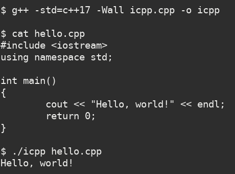
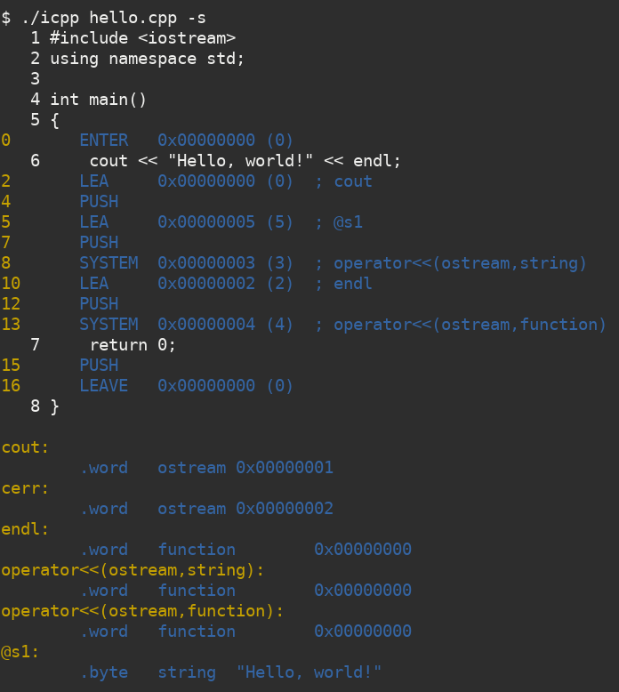

# icpp: an interpreter for C++

This project is inspired by: [c4 - C in four functions](https://github.com/rswier/c4)

Try the following:

```
g++ icpp.cpp -o icpp
./icpp hello.cpp
./icpp icpp.cpp hello.cpp  # (not finished yet)
```

Screenshots:




