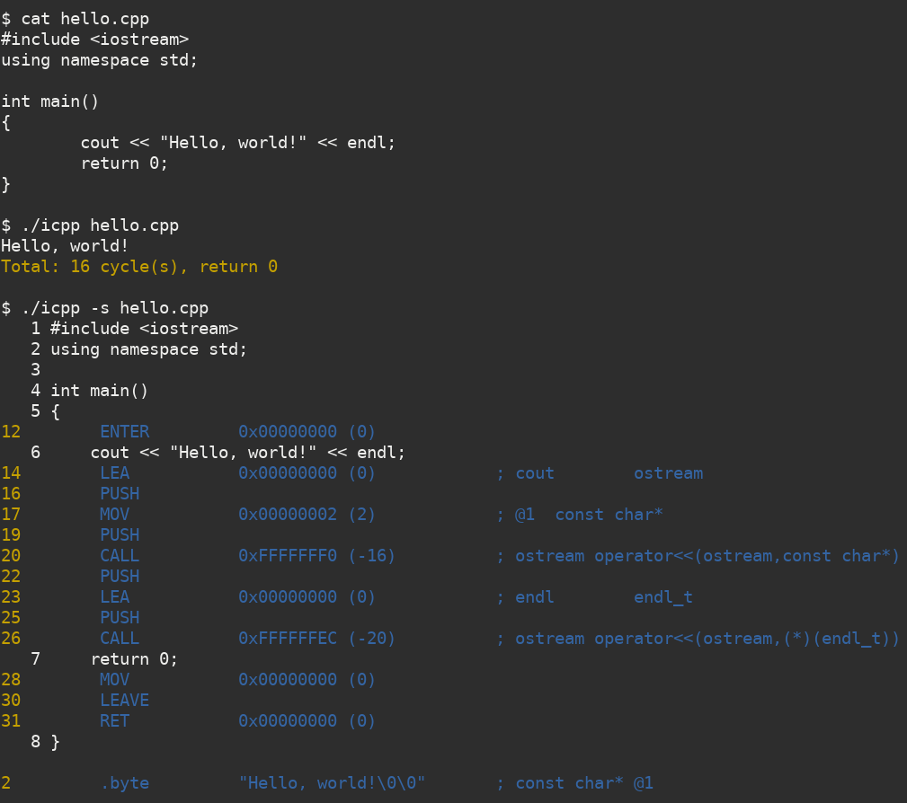

# icpp: an interpreter for C++

## Motivation

This project is inspired by **[c4 - C in four functions](https://github.com/rswier/c4)**.

I am trying to implement an interpreter for modern C++. This should be an efficient way to learn details of the language, as well as related compiler techniques. The goal is to make the interpreter interpret itself, and I am still on the way.

## Quick Start

For quick start, try the following:

```
g++ -Wall -std=c++17 icpp.cpp -o icpp
./icpp hello.cpp
./icpp icpp.cpp hello.cpp  # (not finished yet)
```

The assembly code can be shown in two ways:

```
./icpp -s hello.cpp # as static parsing
./icpp -v hello.cpp # as runtime tracking
```

## Screenshots



## More Examples

More interpretable demo code can be found in `tests/`.
